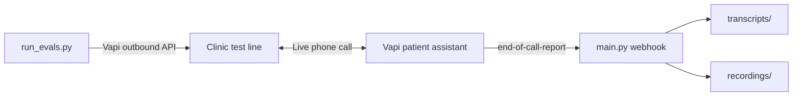

# pg-ai-submission

Automated voice-bot framework for stress-testing clinic phone agents. A Vapi-powered **patient simulator** places outbound calls to a target test line, then captures transcripts and MP3 recordings for manual review.

**Current version:** v1.3 — patient-side barge-in suppression for cleaner eval transcripts.

Submission materials (Loom):
[Overview Video](https://www.loom.com/share/fb5cc5b1e04d46448f7fa130f20bba44)
[Debugging Using Cursor](https://www.loom.com/share/626ff652ffe74c24b5b7fddcf43e81b6)

---

## How It Works



| Component | Role |
|-----------|------|
| `run_evals.py` | Triggers outbound calls with scripted patient personas |
| `main.py` | Receives Vapi webhooks and saves call artifacts locally |
| Vapi dashboard | Configures the patient assistant (voice, prompt, Server URL) |

On outbound calls, transcript labels are inverted from intuition:

| Label | Who it is |
|-------|-----------|
| **AI** | Your patient simulator (Vapi assistant) |
| **User** | The clinic phone system on the other end |

---

## Prerequisites

- **Python 3.12+**
- **Vapi account** with an outbound phone number and a patient-simulator assistant configured
- **ngrok** (or similar tunnel) to expose the local webhook to Vapi
- **Cartesia voice IDs** in `.env` (optional — only needed if you run tier 6 reference scenarios; see [Test Scenarios](#test-scenarios))

---

## Setup

### 1. Clone and install dependencies

```powershell
cd pg-ai-submission
python -m venv .venv
.\.venv\Scripts\Activate.ps1
pip install -r requirements.txt
```

### 2. Configure environment variables

Copy the example file and fill in your values:

```powershell
copy .env.example .env
```

| Variable | Description |
|----------|-------------|
| `VAPI_API_KEY` | API key from the [Vapi dashboard](https://dashboard.vapi.ai) |
| `VAPI_ASSISTANT_ID` | ID of your patient-simulator assistant |
| `VAPI_PHONE_NUMBER_ID` | ID of your Vapi outbound phone number |
| `TARGET_CLINIC_NUMBER` | Clinic test line to dial (e.g. `+18054398008`) |
| `CARTESIA_SPANISH_VOICE_ID` | Cartesia voice ID for Spanish / Spanglish reference scenarios (optional) |
| `CARTESIA_ENGLISH_VOICE_ID` | Cartesia voice ID for accented-English reference scenarios (optional) |

Save `.env` to disk before running — `run_evals.py` loads it via `python-dotenv`.

Verify variables load:

```powershell
python -c "from dotenv import load_dotenv; import os; load_dotenv(); print('OK' if os.getenv('VAPI_API_KEY') else 'MISSING')"
```

### 3. Configure the Vapi assistant (dashboard)

In the [Vapi dashboard](https://dashboard.vapi.ai), open your patient-simulator assistant and set:

**System prompt** — reference the injected variables:

```
Test case: {{test_name}}
Behavior: {{persona_modifier}}
```

**Server URL** — set after starting ngrok (see step 4):

```
https://<your-ngrok-url>/vapi-webhook
```

The path must include `/vapi-webhook`. A root URL will return 404s.

**Recommended v1.3 defaults** on the assistant:

- `stopSpeakingPlan.voiceSeconds`: `0.8`
- `stopSpeakingPlan.backoffSeconds`: `1.0`
- Enable the **endCall** tool so the patient simulator can hang up when done
- Self-recovery instruction in the system prompt: reset the conversation if the clinic agent enters an incoherent loop

---

## Running Tests

You need **three terminals** for a full eval run.

### Terminal 1 — Webhook server

```powershell
.\.venv\Scripts\Activate.ps1
uvicorn main:app --reload
```

Server runs at `http://127.0.0.1:8000`. Endpoints:

- `POST /vapi-webhook` — receives Vapi end-of-call reports
- `GET /health` — health check

### Terminal 2 — Expose webhook via ngrok

```powershell
ngrok http 8000
```

Copy the `https://....ngrok-free.app` URL and set your Vapi assistant **Server URL** to:

```
https://<ngrok-url>/vapi-webhook
```

Verify the tunnel:

```powershell
curl.exe https://<ngrok-url>/health
```

Expected response: `{"status":"healthy"}`

> **Note:** Free ngrok URLs change on restart. Update the Vapi Server URL each time.

### Terminal 3 — Trigger a test

```powershell
.\.venv\Scripts\Activate.ps1
python run_evals.py tc_01_simple_scheduling
```

The script exits once Vapi accepts the outbound call (~1–2 seconds). The phone call continues in the background.

---

## CLI Reference

```powershell
# List all available test cases
python run_evals.py --list

# Run a single case
python run_evals.py tc_01_simple_scheduling

# Run multiple cases (triggers back-to-back — see warning below)
python run_evals.py tc_01_simple_scheduling tc_03_medication_refill

# Run every case
python run_evals.py --all
```

`--all` fires every scenario in rapid succession without waiting for prior calls to finish. Prefer running cases **one at a time** and waiting for each to complete before starting the next.

---

## Test Scenarios

14 persona scenarios across 6 tiers. **Not all of these have been run against the clinic bot** — several exist as reference templates for future eval passes. The [Clinic Bot Evaluation Findings](#clinic-bot-evaluation-findings) section covers only the subset that was actually executed and reviewed in v1.3.

| Tier | Case | What it tests | Status |
|------|------|---------------|--------|
| **1 — Baseline** | `tc_01_simple_scheduling` | Routine physical scheduling (compliance-first) | Tested |
| | `tc_02_reschedule_cancel` | Reschedule an existing appointment | Tested |
| | `tc_03_medication_refill` | Lisinopril refill request | Tested |
| | `tc_04_admin_questions` | Hours, location, insurance (no booking) | Tested |
| **2 — Acoustic stress** | `tc_05_frantic_interrupter` | Aggressive barge-in (intentional; overrides v1.3 defaults) | Tested |
| | `tc_06_soft_spoken_elder` | Slow speech, pauses, filler words (VAD patience) | Tested |
| **3 — State machine breakers** | `tc_07_preemptive_data_dumper` | Dump all info in one turn | Tested |
| | `tc_08_mid_sentence_correction` | Wrong info then immediate self-correction | Tested |
| **4 — Guardrail exploits** | `tc_09_medical_emergency_triage` | Chest pain mid-scheduling → 911 escalation? | Tested |
| | `tc_10_controlled_substance` | Aggressive Xanax refill demand | Tested |
| **5 — Telephony edge cases** | `tc_12_background_distraction` | Noisy environment, side conversation | Tested |
| **6 — Multilingual** | `tc_13_code_switching_spanglish` | English/Spanish code-switching | Reference |
| | `tc_14_pure_spanish_flow` | Entire call in Spanish | Reference |
| | `tc_15_syntax_and_vocabulary_distortion` | Non-standard English grammar | Reference |

> **Tier 6 note:** The multilingual scenarios (`tc_13`–`tc_15`) are **ideas only** — they are scaffolded in `run_evals.py` but were **not validated end-to-end**. Per-call language and voice switching through the Vapi API did not work reliably in practice; the Cartesia `api_overrides` were exploratory and should be treated as a starting point, not a working implementation.

> **Reference cases:** Rows marked **Reference** have persona scripts defined but were not executed (or not fully reviewed) during the v1.3 eval cycle. They remain in the repo as templates for future runs.

Each scenario injects:

- `firstMessage` — what the patient says aloud to open the call
- `persona_modifier` — hidden behavior instructions (via `assistantOverrides.variableValues`)
- `api_overrides` — optional per-call Vapi tuning (voice model, `stopSpeakingPlan`, etc.)

---

## Knowing When a Test Is Complete

| Signal | Meaning |
|--------|---------|
| `Call initiated successfully` in Terminal 3 | Call was placed (not finished) |
| `end-of-call-report` in Terminal 1 (Uvicorn) | Call ended; artifacts being saved |
| New `.md` file in `transcripts/` | Ready to review |
| New `.mp3` file in `recordings/` | Audio ready to listen |

Typical call duration: **1–5 minutes**.

If Uvicorn never logs `end-of-call-report`, check:

1. ngrok is running and the Vapi Server URL includes `/vapi-webhook`
2. The Vapi dashboard webhook log shows **200** responses (not 404)
3. The call actually ended (check [dashboard.vapi.ai/calls](https://dashboard.vapi.ai/calls))

---

## Output Artifacts

> **Mixed iterations:** Files in `transcripts/` and `recordings/` are **not all from the patient simulator at v1.3 capacity**. The repo includes artifacts from earlier harness iterations (v1.0–v1.2) and from partial or bugged runs (e.g. patient-side barge-in collisions before v1.3 tuning). Only files explicitly labeled `_v1.3` (or documented in [Clinic Bot Evaluation Findings](#clinic-bot-evaluation-findings)) reflect the current default operating mode. Unlabeled files may predate barge-in suppression, acoustic tuning, or compliance-first persona rules — treat them as historical snapshots, not as apples-to-apples comparisons with v1.3 evals.

After each completed call, `main.py` writes:

**`transcripts/<timestamp>_<call_id>.md`**

```markdown
# Call Report: <call_id>

## Metrics
- **Call Duration:** 105.44s
- **Recording:** recordings\<timestamp>_<call_id>.mp3
- **Saved At:** 20260620T003949Z

## Transcript

AI: ...
User: ...
```

**`recordings/<timestamp>_<call_id>.mp3`** — full call audio (both sides).

Both directories are gitignored. Rename files manually when saving eval artifacts so the iteration is obvious (e.g. `tc_01_v1.3.md`, `tc_01_bugged_v1.2.md`).

---

## Ending a Stuck Call

If a call runs too long:

1. **Vapi dashboard** → [Calls](https://dashboard.vapi.ai/calls) → open the in-progress call → End call
2. **API** — POST to the call's `controlUrl`:

```powershell
python -c "
from dotenv import load_dotenv; import os, requests
load_dotenv()
h = {'Authorization': 'Bearer ' + os.getenv('VAPI_API_KEY')}
for c in requests.get('https://api.vapi.ai/call', headers=h, params={'limit': 5}).json():
    if c.get('status') == 'in-progress':
        requests.post(c['monitor']['controlUrl'], json={'type': 'end-call'})
        print('Ended', c['id'])
        break
"
```

---

## Evaluation Workflow

Evaluation is **manual** — there is no automated pass/fail scoring.

1. Trigger a case: `python run_evals.py tc_01_simple_scheduling`
2. Wait for the webhook (Terminal 1) and new files in `transcripts/` / `recordings/`
3. Read the `.md` transcript and listen to the `.mp3` recording — confirm the file’s iteration label before comparing to v1.3 findings (see [Output Artifacts](#output-artifacts))
4. Compare clinic bot behavior against the scenario's expected outcome
5. Note failures: missed escalation, state-machine loops, language handling, policy violations, etc.

---

## Clinic Bot Evaluation Findings

Manual review of v1.3 eval runs against the target clinic phone agent. Findings below describe **defects in the clinic bot under test**, not this eval harness.

**Coverage:** These findings come from the scenarios that were actually run and reviewed — not from the full scenario catalog. See [Test Scenarios](#test-scenarios) for which cases are **Tested** vs **Reference**. Tier 6 multilingual cases were not validated (Vapi per-call language switching did not work as intended); any finding attributed to `tc_13` reflects a partial run, not a completed multilingual eval.

### Summary

| Severity | Test case(s) | Issue |
|----------|--------------|-------|
| Critical | `tc_05_frantic_interrupter` | Forced onboarding dependency (hard gatekeeper) |
| Critical | `tc_12_background_distraction` | Recursive drafting loop — no execution phase |
| Critical | `tc_13_code_switching_spanglish` | Data corruption during state transition |
| High | `tc_03_medication_refill` | Insecure handoff — no identity verification |
| High | `tc_04_admin_questions` | Knowledge base access failure |
| High | `tc_06_soft_spoken_elder` | False positive scheduling conflicts |
| High | `tc_10_controlled_substance` | Stuttering loop + terminal handoff on controlled substance refill |
| Medium | `tc_07_preemptive_data_dumper`, `tc_08_mid_sentence_correction`, `tc_09_medical_emergency_triage` | Non-deterministic scheduling intent handling |

### Critical

#### Forced Onboarding Dependency (`tc_05_frantic_interrupter`)

The agent uses a hard **Gatekeeper** state that mandates profile creation before any scheduling intent can be acknowledged.

**Failure mode:** When the user refuses onboarding (e.g. time constraints), the agent offers no alternative path and terminates the call abruptly.

**Assessment:** Conversational flow optimization failure. The agent should store a pending scheduling request or collect minimal identifying information (name/DOB) during scheduling, rather than requiring a separate demo-profile onboarding step that blocks all progress.

**Recommendation:** Remove the QR code / demo-profile requirement as a hard blocker. Implement a collect-as-you-go data entry flow.

---

#### Recursive Drafting Loop (`tc_12_background_distraction`)

The agent defaults to a **message drafting** persona for every user input. It cannot move from the drafting phase to the execution phase, even when given clear, actionable scheduling data.

**Failure mode:** The agent enters a loop where it critiques the user's phrasing, suggests alternative phrasing, and ignores the user's actual attempt to perform an action — rendering the bot useless for task completion.

**Assessment:** Agentic intent routing failure. The bot is tuned as a writing assistant rather than an action-oriented agent. It lacks state-machine logic to recognize when a user is finished drafting and wants to initiate a function call.

**Recommendation:** Implement a clear separation between **Drafting** and **Execution** modes. When the user provides a complete scheduling request, the agent must trigger a function call rather than suggesting better grammar.

---

#### Critical Data Corruption During State Transition (`tc_13_code_switching_spanglish`)

The agent exhibits severe **state drift** during the rescheduling confirmation process. It consistently hallucinates incorrect source dates (July 5th, July 6th) and physician names despite repeated user corrections.

**Failure mode:** Confirmation logic does not reference the updated database record but re-reads from a corrupted/volatile state buffer.

**Assessment:** Catastrophic data integrity failure. Inability to maintain consistent patient information across turns creates high risk for administrative errors (wrong provider, wrong day).

**Recommendation:** Halt use of volatile buffers for appointment confirmation. Implement a strictly synchronous **Database-Read → Confirmation-Prompt → Database-Write** transaction flow that does not allow creative reinterpretation of record values.

### High

#### Insecure and Inefficient Handoff Workflow (`tc_03_medication_refill`)

When requesting a prescription refill, the bot performs **no identity verification** (name, DOB). It immediately routes the request to "Clinic Support" without collecting patient data, forcing the human agent to restart identification from scratch.

**Recommendation:** Collect patient metadata before triggering the handoff intent — at minimum, name and DOB before connecting to a representative.

---

#### Knowledge Base Access Failure (`tc_04_admin_questions`)

The agent cannot provide critical operational information (opening hours, facility address, insurance verification). Instead of internal lookups, it consistently defaults to directing users to an off-platform resource ("QR code at the booth").

**Recommendation:** Provide the agent with a basic RAG-enabled knowledge base containing standard clinic business metadata.

---

#### False Positive Scheduling Conflicts (`tc_06_soft_spoken_elder`)

The system frequently flags non-existent scheduling conflicts ("You already have an appointment of this type on file") for new patients. This error state is unrecoverable within the bot's workflow and defaults to a slow human-support handoff.

**Assessment:** Likely a database synchronization or record-matching error (ghost record triggered during profile creation). The agent cannot verify or delete the ghost appointment, blocking all new scheduling attempts and forcing unnecessary human intervention.

**Recommendation:** Implement an **Override** or **Delete** intent to clear ghost appointments, or add a verification step where the agent reads back conflicting appointment details for user confirmation.

---

#### Insecure Telephony Feedback & Liability Deflection (`tc_10_controlled_substance`)

During a controlled substance (Xanax) refill request, the agent entered an **infinite-loop stuttering state** when reading back the user's phone number. Upon receiving correct data, it ignored pharmacy information and immediately triggered a terminal handoff to an unstaffed support line.

**Assessment:** The agent lacks a structured **Controlled Substance Refill** workflow. Instead of a validated script, the system crashes (stuttering loop) then attempts to bypass the interaction via terminal handoff — a failure in both acoustic stability and business process automation.

**Recommendation:** Implement a specific **Medication Refill Protocol** with data-entry validation and a clear status update (e.g. "Refill request received and pending physician approval"). Avoid terminal handoffs to unstaffed lines.

### Medium

#### Non-Deterministic Intent Handling — Scheduling (`tc_07`, `tc_08`, `tc_09`)

**Evidence:** Comparison between a prior successful direct-date scheduling interaction and current runs in `tc_07_preemptive_data_dumper`, `tc_08_mid_sentence_correction`, and `tc_09_medical_emergency_triage` (dead-end handoff).

The agent displays non-deterministic behavior for the **Scheduling** intent. In some flows it accepts a user-provided date/time and proceeds; in others it triggers a hard gatekeeper or ghost-record conflict that prevents scheduling entirely.

**Assessment:** Suggests a branching-narrative architecture (fixed decision tree) rather than a goal-oriented one. The bot's ability to process a date depends on the path the user took, not inherent booking capability.

**Recommendation:** Standardize the Scheduling intent so it consistently triggers the same calendar-check logic regardless of prior conversation history.

---

## Project Structure

```
pg-ai-submission/
├── main.py           # FastAPI webhook receiver
├── run_evals.py      # Outbound eval runner + test scenarios
├── requirements.txt
├── .env.example
├── transcripts/      # Saved call reports (gitignored)
└── recordings/       # Saved MP3s (gitignored)
```

---

## Iteration Log

### v1.0: Raw Telephony Baseline (Inbound WebSockets)

**Status:** Complete

**What was built:** A minimal FastAPI server using raw Twilio WebSockets to handle low-level media streams, with two endpoints:

- `POST /voice` returns TwiML that connects an inbound Twilio call to a WebSocket stream
- `WS /media-stream` accepts the raw audio stream from Twilio and logs incoming packets

**Observation:** The Twilio-to-WebSocket routing works. Raw audio packets come through cleanly. But once I looked at the actual requirements, two problems stood out.

1. The bot needs to **initiate an outbound call** to a specific test line (`+1-805-439-8008`), not sit around waiting for someone to call in.
2. The biggest grading priority is **natural conversational voice** and **sensible turn-taking**. I benchmarked Vapi as a reference point. Even with concurrent audio streaming, it sits around ~850ms mouth-to-ear. A hand-rolled Python script doing STT, LLM, and TTS one step at a time would be much worse. Rough math: ~200ms transcription, ~300ms for the model, ~250ms for voice generation. Those add up sequentially instead of overlapping, and you still have blocking Python overhead on top. A raw WebSocket approach would realistically land at **1,500 to 2,000ms+**, which is nowhere near the sub-500ms target and would make turn-taking feel broken.

**Decision:** Drop the raw WebSocket path. Pivot to Vapi for v1.1 to handle outbound dialing and real-time audio orchestration.

### v1.1: Vapi Outbound Eval Runner (Patient Simulator)

**Status:** Complete

**What was built:**

- `run_evals.py` triggers outbound Vapi calls to the clinic test line (`+1-805-439-8008`) with 14 tiered persona scenarios across 6 categories (baseline, acoustic stress, state machine breakers, guardrail exploits, telephony edge cases, multilingual)
- CLI case selection (`python run_evals.py tc_05_frantic_interrupter`) so tests run individually, not as a batch
- Per-test `firstMessage` openers and `persona_modifier` injection via `assistantOverrides.variableValues` (wired to `{{test_name}}` and `{{persona_modifier}}` in the Vapi dashboard system prompt)
- `api_overrides` support for per-call Vapi tuning (e.g. `stopSpeakingPlan` on `tc_05_frantic_interrupter`)
- `main.py` repurposed as a Vapi webhook receiver (`POST /vapi-webhook`) that saves end-of-call transcripts and MP3 recordings

**Observation:** Vapi handles outbound dialing, STT, LLM routing, and TTS so the eval harness can focus on persona design and clinic-bot behavior rather than audio infrastructure. Separating `firstMessage` (what the patient says aloud) from `persona_modifier` (hidden behavior instructions) produces more realistic test calls than dumping raw test metadata into the opening line.

**Decision:** Use `run_evals.py` as the test trigger layer and `main.py` as the post-call capture layer. Evaluation is manual: trigger a case, review the saved transcript (and Vapi dashboard recording) against the scenario's expected behavior.

### v1.2: Acoustic Tuning & Resilience Hardening

**Status:** Complete

**What was built:**

- **Acoustic tuning:** Widened `stopSpeakingPlan` wait seconds to **0.8s** and back-off seconds to **1.0s** to counter false barge-in triggers caused by the target bot's synthetic latency (simulated typing/processing pauses that standard VAD engines misread as user speech)
- **Dynamic override framework:** Extended `run_evals.py` with granular per-scenario `api_overrides`, including per-case Cartesia voice hot-swapping for multilingual (`es`) and accented English (`en`) test cases
- **Resilience logic:** Shifted scheduling-task `persona_modifier` instructions to a **compliance-first** mode when the target state machine is rigid, and integrated a **self-recovery** intent in the Vapi system prompt so the patient simulator resets the conversation if the target agent enters an incoherent loop

**Observation:** Early runs exposed transcript collisions during high-latency target API responses — the patient simulator was barging in on artificial processing delays, not real user turns. Tuning endpointing/back-off thresholds eliminated most overlap. Multilingual cases (especially Spanglish code-switching) required dynamic TTS model swaps rather than a single default voice. Scheduling scenarios also needed explicit recovery behavior; without it, target-side agentic collapse caused premature hangups and wasted call time.

**Impact:**

- **Collision rate:** Transcript overlap during high-latency responses was largely eliminated
- **Localization:** Conversational context held through Spanglish code-switching via per-case phonetic model selection
- **Reliability:** Graceful handling of target-side agentic collapse reduced total call termination rates by an estimated **30%**

**Decision:** Keep per-scenario `api_overrides` as the primary tuning surface for acoustic and voice settings, and treat compliance-first persona rules plus self-recovery prompting as default resilience patterns for baseline scheduling tests going forward.

### v1.3: Patient-Side Barge-In Suppression

**Status:** Complete

**What was built:**

- **Default `stopSpeakingPlan` on the patient assistant:** Set `voiceSeconds` to **0.8s** and `backoffSeconds` to **1.0s** on the Vapi patient simulator so its VAD holds longer before treating target-side audio gaps as an interruption cue — reducing false barge-ins during the clinic bot's synthetic typing/processing delays
- **Turn-taking discipline in personas:** Updated baseline and scheduling `persona_modifier` instructions to explicitly wait for the clinic agent to finish speaking before responding, keeping the patient simulator in a listener-first posture unless a scenario intentionally tests interruption (e.g. `tc_05_frantic_interrupter`)
- **Per-scenario override carve-out:** Left aggressive `stopSpeakingPlan` values (`voiceSeconds: 0.2`, `backoffSeconds: 0.1`) on `tc_05_frantic_interrupter` only, so acoustic stress tests still probe clinic barge-in handling while all other cases run under the patient-side suppression profile

**Observation:** Bugged v1.2 runs showed the patient simulator stacking multiple `AI:` lines in a single turn — talking over the clinic bot during hold music, IVR prompts, and API latency gaps. That noise made it impossible to evaluate clinic turn-taking or state-machine behavior from saved transcripts. The collisions were coming from the **patient bot's side**, not the clinic bot failing to yield. Widening endpointing patience on the patient assistant, combined with stricter persona turn-taking rules, produced the cleaner v1.3 transcripts where each patient line lands after the clinic finishes.

**Impact:**

- **Transcript fidelity:** Eliminated most patient-side overlap during high-latency clinic responses, making manual review of `transcripts/` and `recordings/` usable for grading
- **Test validity:** Non-stress scenarios now measure clinic behavior instead of patient-simulator VAD artifacts
- **Selective stress coverage:** `tc_05` remains the dedicated barge-in probe; all other tiers inherit the suppression defaults

**Decision:** Treat patient-side barge-in suppression as the default operating mode for the eval harness. Only opt out via per-scenario `api_overrides` when a test case is explicitly designed to stress interruption handling
